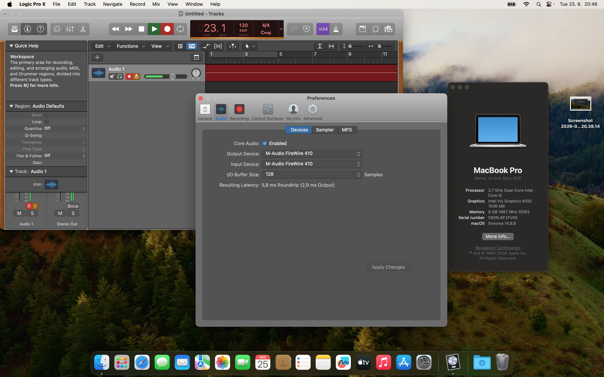

# Compatibility matrix

This file records hardware-tested macOS compatibility for the macfw M-Audio FireWire 410 driver.

Only configurations that have actually been tested on real hardware are marked validated. Versions that appear likely to work based on neighboring macOS releases are still listed as untested until verified.

## M-Audio FireWire 410

| macOS version | Intel Mac | Installer | Playback | Capture | 44.1/48 kHz switching | Disconnect/reconnect | Sleep/wake | Status |
|---|---|---|---|---|---|---|---|---|
| Monterey 12.7.6 | validated | validated | validated | validated | validated | validated | not separately recorded | **Validated** |
| Ventura 13.7.8 | validated | validated | validated | validated | validated | validated | validated | **Validated** |
| Sonoma 14.8.9 | validated | validated | validated | validated | validated | validated | validated | **Validated** |
| Sequoia 15.x | validated | validated | validated | validated | validated | validated | not separately recorded | **Validated** |

The native control panel and current transport/control architecture have also been exercised on the validated development systems. The key control-path rule is common across releases: the GUI/CLI use the active transport's Unix-socket IPC rather than opening FireWire independently.

For the `0.02.000` candidate, the complete packaged control lifecycle was additionally hardware-validated: package installation, launchd startup, transport status, normal GUI/CLI control changes, Reset Defaults, saved-state restoration after reboot, and saved-state restoration after physical FW410 disconnect/reconnect all behaved as expected. Sequoia testing additionally confirmed input/output operation and preservation of the configured controls through the same reset/reconnect lifecycle.

## Monterey 12.7.6

The release package was installed on a freshly installed macOS Monterey 12.7.6 system.

Observed result:

- package installation completed normally;
- the HAL driver and launchd transport service became operational;
- the FW410 worked as expected after installation;
- normal playback and capture were confirmed;
- no pre-existing macfw development environment or driver installation was present.

This remains a clean fully validated installation baseline.

## Ventura 13.7.8

Ventura 13.7.8 has been tested on real FW410 hardware.

Observed result:

- the driver/runtime became operational normally;
- playback and capture worked at both supported native rates;
- 44.1/48 kHz switching worked;
- disconnect/reconnect recovery worked;
- sleep/wake recovery worked;
- normal control-panel operation remained available through the transport-owned IPC.

Ventura should therefore no longer be described as inferred-only or untested.

## Sonoma 14.8.9

The release installer was tested on macOS Sonoma 14.8.9 and the functional tests were repeated after an initially degraded capture observation.

Final observed result:

- package installation completed normally;
- the interface was detected and managed correctly;
- playback behaved the same as on the previously validated macOS versions;
- capture/recording behaved the same as on the previously validated macOS versions;
- native 44.1/48 kHz operation remained functional;
- physical transport behavior remained functional;
- sleep/wake was tested with audio active before sleep and audio resumed correctly in both directions after wake.

The earlier degraded-capture observation was not reproduced in the repeated tests and is no longer considered an active Sonoma compatibility limitation.

Test screenshot: [`fw410/pictures/Screenshot3.jpg`](fw410/pictures/Screenshot3.jpg)

### Sleep/wake observation

During the validated Sonoma sleep/wake test, the FW410 remained in its operational personality while the computer slept. It did **not** fall back into the `FW Bootloader` personality.

This differs from the observed behavior of the original vendor driver, where sleep commonly caused the interface to return to bootloader mode and require reinitialization. With macfw, playback and capture resumed after wake without that bootloader transition.

This is a useful behavioral improvement of the current user-space transport/service lifecycle, although additional machines and sleep durations should still be tested before treating the behavior as universal across all hardware configurations.

## Sequoia 15.x

The `0.02.000` release candidate was tested on macOS Sequoia on the Intel development Mac and behaved the same as on the previously validated releases.

Observed result:

- package installation and normal service startup worked;
- playback/output operation worked;
- capture/input operation worked;
- 44.1/48 kHz operation remained functional;
- the native control panel and hardware controls worked normally;
- Reset Defaults worked;
- physical disconnect/reconnect recovery worked;
- configured input/output and mixer/control state was restored as expected after reconnect;
- no macfw-specific functional regression was observed compared with Monterey, Ventura or Sonoma.

Logic Pro on this Sequoia installation was noticeably more resource-demanding on the older test MacBook. This was observed as host/application resource pressure rather than a macfw transport or FW410 compatibility failure. Better-performing Intel hardware may provide a more comfortable DAW workload, but broader machine testing is still needed before making performance claims.

With this test, macfw has real-hardware validation across Monterey, Ventura, Sonoma and Sequoia on Intel Macs.

## Interpretation

Compatibility status in this file uses the following meanings:

- **Validated** — tested on real FW410 hardware with expected audio/runtime behavior confirmed.
- **Untested** — no hardware test has been performed, regardless of how likely compatibility may appear from adjacent macOS versions.

## Reporting additional results

When adding another compatibility result, record at minimum:

- exact macOS version;
- Intel Mac model;
- FireWire connection/adapters;
- package build/version;
- playback result;
- capture result;
- 44.1/48 kHz result;
- disconnect/reconnect result;
- sleep/wake result where tested;
- control-panel result where relevant;
- persistent-control/reset result where relevant;
- any transport or installer log anomalies.
