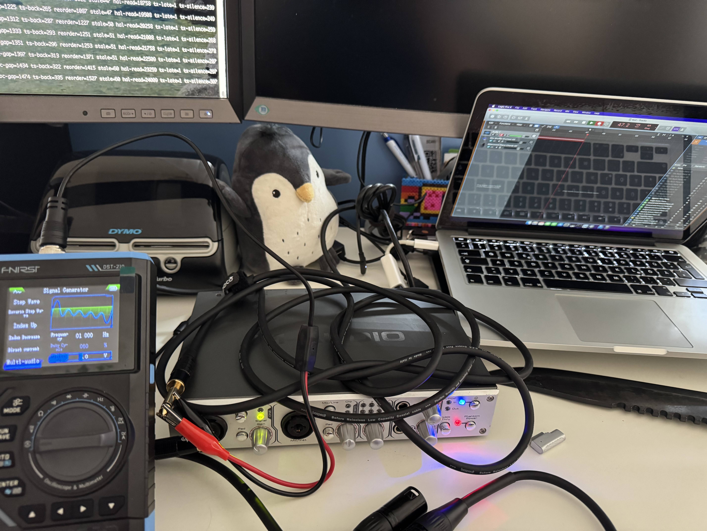

- one capture diagnostic snapshot showed 866,512 frames delivered from the shared ring to CoreAudio out of 886,912 requested frames;
- 20,400 frames were zero-filled, approximately 2.3% of requested input and roughly 425 ms at 48 kHz;
- the recorded signal was recognizable but audibly broken, similar to the early playback transport before its buffering/scheduling margin was increased.

The first producer interval was also short by approximately the same amount as the total zero-fill deficit, indicating a strong startup/prefill component rather than a persistent 2.3% steady-state loss. Subsequent producer intervals were essentially at the expected 48 kHz cadence, while the shared queue oscillated in a healthy low-thousands range.

Development therefore moved to a capture pre-roll experiment: keep the capture ring inactive until CoreAudio is actually issuing `ReadInput`, accumulate a controlled 4,096-frame (~85 ms) cushion, discard older startup backlog beyond that cushion, and only then enable live capture consumption. The goal is to separate startup starvation from any remaining steady-state NuDCL scheduling jitter without changing the now-proven HAL topology or shared-memory lifecycle.

## 2026-08-19 — Native 48 kHz CoreAudio capture reaches clean steady state

The 48 kHz capture path progressed from “recording works but is broken” to a controlled recording with no audible steady-state dropouts and no significant sample-level discontinuities after startup.

Workbench photo: [`pictures/Picture1.jpg`](pictures/Picture1.jpg)



The decisive receive-side progression was:

1. **full 256-slot publication (~32 ms):** recognizable capture, but heavily broken;
2. **32-cycle publication (~4 ms):** capture became almost clean;
3. **global DBC ordering:** remaining cracks were reduced further, but independent publication groups could still be mixed;
4. **terminal-slot-confirmed completed groups:** userspace consumes only the exact 32-slot group whose terminal receive DCL has published its metadata update.

The final validated pipeline is:

`FW410 input -> device-to-host ISO -> NuDCL receive ring -> completed 32-cycle group -> AMDTP/DBC validation -> MBLA-24 decode -> 4-channel Float32 capture SHM -> AudioServerPlugIn ReadInput -> Logic Pro`

A controlled 1 kHz, 1.0 V, 60% duty-cycle source was used for objective comparison. The development recordings showed:

| Recording | Receive state | Detected discontinuity clusters | Approx. rate |
|---|---|---:|---:|
| test 17 | early/full-ring path | 434 | 5.75/sec |
| test 19 | 32-cycle publication + global DBC ordering | 70 | 2.23/sec |
| test 20 | completed-group consumption | 1 startup event | 0.03/sec |

### Short audible comparison

Short excerpts are intentionally referenced rather than committing the large original AIFF recordings. These links are placeholders for compact clips extracted from equivalent portions of the controlled test recordings:

- **Test 19 — before completed-group consumption:** [`pictures/audio/capture-test19-before.wav`](pictures/audio/capture-test19-before.wav)
- **Test 20 — after completed-group consumption:** [`pictures/audio/capture-test20-after.wav`](pictures/audio/capture-test20-after.wav)

The clips should use the same time window from each recording where practical so the remaining cracks in test 19 can be compared directly with the clean test 20 result. The source parameters were 1 kHz, 1.0 V, 60% duty cycle at a 48 kHz capture rate.

In the final run, representative transport status was:

```text
capture frames=940064 (delta 96000)
active=1 queued=3968 drops=0 malformed=0 invalid=0
chunks=4981 dbc-gap=0 ts-back=4 reorder=0 stale=0
```

The producer remained at exact 48 kHz steady-state cadence, the shared capture queue stayed near the intended ~4k-frame cushion, and DBC gaps/reorders/stale packets remained zero. Small timestamp-regression diagnostics did not correspond to audible or measurable PCM discontinuities.

This milestone establishes **native 48 kHz CoreAudio capture as functionally validated**. The next step is to merge this proven capture engine with the proven real 10-channel playback engine in a single full-duplex rate-aware runtime.