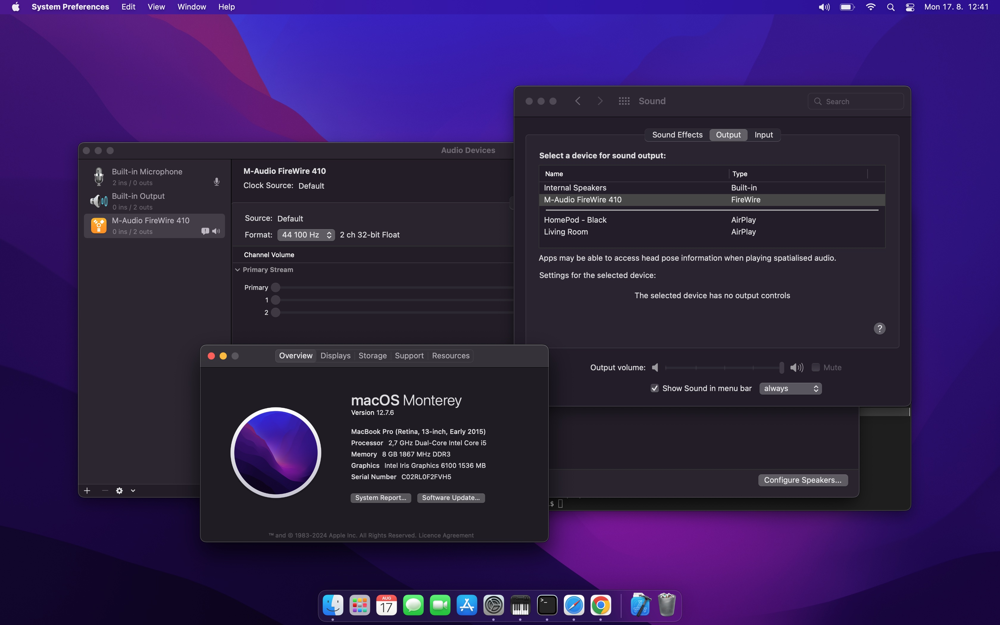
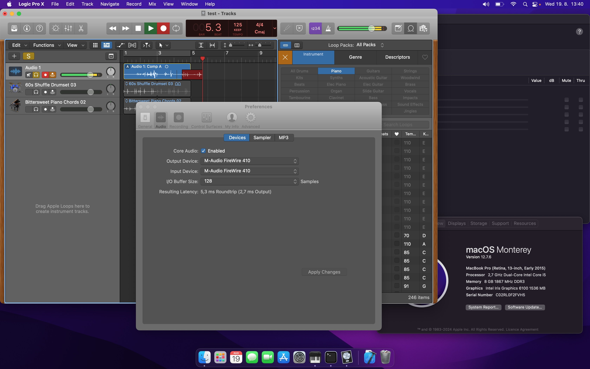

# FW410 project history

This file records visible project milestones rather than every diagnostic experiment. Detailed protocol and transport findings remain under `fw410/analysis/`.

## 2026-08-25 — Transport status ABI and explicit engine readiness validated

A versioned shared-memory transport-status ABI was added between the long-running `haltransport` supervisor and diagnostic consumers. This establishes the availability signal that the CoreAudio HAL will use to remain logically registered while the physical FireWire transport disconnects and recovers.

The v1 status block reports:

- `OFFLINE`, `RECOVERING`, or `ONLINE`;
- requested native rate;
- active native-engine rate;
- native-engine PID;
- transition sequence;
- heartbeat sequence.

The diagnostic `transportstatus` tool validated the state machine during both normal 44.1/48 kHz switching and physical disconnect/reconnect.

A key refinement was an explicit native-engine READY handshake. `ONLINE` no longer means that a child process merely exists or survived a fixed grace period. The 48 kHz engine signals READY after successful duplex ISO startup; the 44.1 kHz engine signals READY only after duplex ISO startup and successful post-start AV/C 44.1 kHz reassertion.

During a physical reconnect, multiple transient child PIDs appeared while the FireWire bus and FW410 personality were still changing. Each remained correctly classified as `RECOVERING` and disappeared when the attempt failed. Only the final stable child signaled READY and caused the supervisor to publish `ONLINE`.

Representative end of the validated reconnect sequence:

```text
transport state: RECOVERING
    requested rate: 48000 Hz
    active rate:    48000 Hz
    engine pid:     1101

transport state: ONLINE
    requested rate: 48000 Hz
    active rate:    48000 Hz
    engine pid:     1101
```

The status SHM also exposed two Darwin-specific lifecycle details during implementation. Its POSIX SHM name was shortened to `/macfw_fw410_status_v1`, and the single publisher now recreates the object on supervisor startup so stale objects from earlier ABI/build attempts cannot poison a new mapping.

This milestone establishes **transport availability and real native-engine readiness as explicit, versioned state rather than inferred process state**.

The next checkpoint is intentionally non-invasive: map/read the status ABI inside the AudioServerPlugIn and prove what `coreaudiod` observes during rate changes and reconnect recovery. Playback/capture behavior should remain unchanged until HAL-side observation is validated.

## 2026-08-17 — First native macOS audio device

The macfw HAL AudioServerPlugIn was accepted by CoreAudio and appeared as **M-Audio FireWire 410** in both Audio MIDI Setup and the normal macOS audio output-device selector.

At this milestone:

- the device can be selected as the default and system output;
- CoreAudio starts and stops the device I/O thread successfully;
- stereo output is published;
- 44.1 kHz and 48 kHz are selectable;
- the HAL device is still synthetic at this exact checkpoint, so `WriteMix` accepts but discards PCM and no physical FW410 audio is produced yet.

Screenshot: [`pictures/Screenshot1.jpg`](pictures/Screenshot1.jpg)



This milestone proves the user-space HAL approach can expose the legacy FireWire 410 as a normal selectable macOS audio interface without requiring DriverKit provisioning. The next milestone is routing the HAL `WriteMix` PCM stream through shared memory into the already-proven native 44.1 kHz FireWire/AMDTP transport.

## 2026-08-17 — First clean hardware-backed CoreAudio playback

The complete 44.1 kHz playback path worked end to end with normal macOS audio applications and produced clear audio on physical FW410 Analog Outputs 1 and 2.

The proven path at this checkpoint is:

`macOS application -> CoreAudio HAL -> WriteMix -> shared-memory stereo Float32 ring -> halbridge44100 -> 10-channel FW410 PCM mapping -> PcmRingBuffer -> AmdtpPcmStream44100 -> FireWire ISO -> M-Audio FireWire 410`

Observed results:

- CoreAudio continuously supplied 192-frame `WriteMix` buffers;
- the HAL shared ring was consumed continuously by `halbridge44100`;
- live frame deltas were approximately 88,128-88,896 frames per two-second reporting interval, consistent with the 44.1 kHz stream;
- the FW410-specific post-start AV/C 44.1 kHz reassertion succeeded on both OUTPUT and INPUT plug 0;
- audio on Analog Outputs 1 and 2 was reported clear;
- Ctrl-C followed the guarded ISO/CMP cleanup path and the device read back successfully at 48 kHz after restoration.

This is the first milestone where the macfw CoreAudio device is not merely visible to macOS: ordinary application audio reaches the real FireWire hardware cleanly.

## 2026-08-18 — Native 48 kHz CoreAudio playback

The same HAL/shared-memory architecture was validated at native 48 kHz with no sample-rate conversion.

The initial 48 kHz implementation sounded broken even though the HAL producer cadence was correct. A controlled A/B test isolated the decisive difference to FireWire transmit scheduling margin: the old 128-cycle TX ring with 64-cycle refill halves provided only about 8 ms per half under this workload, while enlarging the ring to 640 cycles with 320-cycle halves provided about 40 ms. With the larger geometry, native 48 kHz audio became clear.

The committed path also uses a 16,384-frame PCM FIFO, drains shared-memory backlog until caught up, requests user-interactive pthread QoS, and avoids redundant AV/C rate CONTROL when the FW410 is already at 48 kHz.

Small load-sensitive dropouts can still occur during unrelated desktop activity. Current diagnostics show zero scheduler-inserted silence at those moments and no distinctive spike in `lateCyclePolls`, so this remains a transport-service jitter issue rather than a proven AMDTP underrun.

With both native 44.1 and 48 kHz playback proven, development moved to a rate-aware `haltransport` supervisor that selects the matching native engine from the HAL-selected CoreAudio rate without rewriting either known-good packet path first.

## 2026-08-18 — Full 10-channel CoreAudio playback validated in Logic Pro

The HAL output stream was expanded from the temporary stereo presentation to the FW410's full 10-channel host playback topology using the mapping already documented in `analysis/stream-topology.md`.

CoreAudio now presents the channels in physical/user-facing order:

1. Analog Out 1
2. Analog Out 2
3. Analog Out 3
4. Analog Out 4
5. Analog Out 5
6. Analog Out 6
7. Analog Out 7
8. Analog Out 8
9. S/PDIF Out L
10. S/PDIF Out R

The transport explicitly permutes these into the FW410's BridgeCo/AMDTP slot order rather than exposing the unusual raw stream positions to applications.

Hardware validation was performed in Logic Pro X. Independent output routing confirmed that **all eight analog outputs and both S/PDIF output channels play correctly**. Ordinary stereo playback continues to land on Analog Outputs 1/2 as intended.

Logic Pro also produced noticeably fewer audible dropouts than browser/YouTube playback during the same development state. This suggests the remaining occasional glitches are influenced by client/system scheduling or buffering as well as the transport service, and are not a blocker for the playback architecture.

This milestone establishes the full FW410 playback side as functionally usable from a multichannel CoreAudio application.

## 2026-08-19 — First end-to-end CoreAudio capture in Logic Pro

The first real FW410 input signal was successfully recorded through the complete user-space capture path at 48 kHz:

Screenshot: [`pictures/Screenshot2.jpg`](pictures/Screenshot2.jpg)



`FW410 Analog In 1 -> FireWire ISO receive -> AMDTP/MBLA decode -> 4-channel shared capture ring -> AudioServerPlugIn ReadInput -> Logic Pro`

At this milestone:

- CoreAudio exposes four input channels: Analog In 1/2 and S/PDIF In L/R;
- the standalone 48 kHz capture transport continuously decodes approximately 95k-97k frames per two-second interval after startup;
- the shared capture ring is now genuinely drained by CoreAudio rather than filling to its 32,768-frame capacity;
- `droppedFrames` remained zero during the successful recording run;
- one capture diagnostic snapshot showed 866,512 frames delivered from the shared ring to CoreAudio out of 886,912 requested frames;
- 20,400 frames were zero-filled, approximately 2.3% of requested input and roughly 425 ms at 48 kHz;
- the recorded signal was recognizable but audibly broken, similar to the early playback transport before its buffering/scheduling margin was increased.

The first producer interval was also short by approximately the same amount as the total zero-fill deficit, indicating a strong startup/prefill component rather than a persistent 2.3% steady-state loss. Subsequent producer intervals were essentially at the expected 48 kHz cadence, while the shared queue oscillated in a healthy low-thousands range.

Development therefore moved to a capture pre-roll experiment: keep the capture ring inactive until CoreAudio is actually issuing `ReadInput`, accumulate a controlled 4,096-frame (~85 ms) cushion, discard older startup backlog beyond that cushion, and only then enable live capture consumption. The goal is to separate startup starvation from any remaining steady-state NuDCL scheduling jitter without changing the now-proven HAL topology or shared-memory lifecycle.

## 2026-08-19 — Native 48 kHz CoreAudio capture reaches clean steady state

The 48 kHz capture path progressed from “recording works but is broken” to a controlled recording with no audible steady-state dropouts and no significant sample-level discontinuities after startup.

Workbench photo: [`pictures/Picture1.jpg`](pictures/Picture1.jpg)


The decisive receive-side progression was:

1. **full 256-slot publication (~32 ms):** recognizable capture, but heavily broken;
2. **32-cycle publication (~4 ms):** capture became almost clean;
3. **global DBC ordering:** remaining cracks were reduced further, but independent publication groups could still be mixed;
4. **terminal-slot-confirmed completed groups:** userspace consumes only the exact 32-slot group whose terminal receive DCL has published its metadata update.

The final validated pipeline is:

`FW410 input -> device-to-host ISO -> NuDCL receive ring -> completed 32-cycle group -> AMDTP/DBC validation -> MBLA-24 decode -> 4-channel Float32 capture SHM -> AudioServerPlugIn ReadInput -> Logic Pro`

A controlled 1 kHz, 1.0 V, 60% duty-cycle source was used for objective comparison. The development recordings showed:

| Recording | Receive state | Detected discontinuity clusters | Approx. rate |
|---|---|---:|---:|
| test 17 | early/full-ring path | 434 | 5.75/sec |
| test 19 | 32-cycle publication + global DBC ordering | 70 | 2.23/sec |
| test 20 | completed-group consumption | 1 startup event | 0.03/sec |

### Short audible comparison

Short excerpts are intentionally referenced rather than committing the large original AIFF recordings. These links are placeholders for compact clips extracted from equivalent portions of the controlled test recordings:

- **Test 19 — before completed-group consumption:** [`pictures/audio/capture-test19-before.wav`](pictures/audio/capture-test19-before.wav)
- **Test 20 — after completed-group consumption:** [`pictures/audio/capture-test20-after.wav`](pictures/audio/capture-test20-after.wav)

The clips should use the same time window from each recording where practical so the remaining cracks in test 19 can be compared directly with the clean test 20 result. The source parameters were 1 kHz, 1.0 V, 60% duty cycle at a 48 kHz capture rate.

In the final run, representative transport status was:

```text
capture frames=940064 (delta 96000)
active=1 queued=3968 drops=0 malformed=0 invalid=0
chunks=4981 dbc-gap=0 ts-back=4 reorder=0 stale=0
```

The producer remained at exact 48 kHz steady-state cadence, the shared capture queue stayed near the intended ~4k-frame cushion, and DBC gaps/reorders/stale packets remained zero. Small timestamp-regression diagnostics did not correspond to audible or measurable PCM discontinuities.

This milestone establishes **native 48 kHz CoreAudio capture as functionally validated**.

## 2026-08-24 — First working 48 kHz full-duplex CoreAudio transport

The proven 10-channel playback path and proven four-channel capture path were merged into the same native 48 kHz transport engine.

The first combined implementation preserved clean playback but made capture heavily broken. All receive integrity counters remained healthy, which ruled out a regression in completed-chunk ordering. The issue was service priority: playback SHM draining and Float32-to-PCM mapping ran before receive-ring consumption, allowing completed RX chunks to remain exposed to DMA reuse for too long.

The fix was to service capture first, then playback/TX, then service capture a second time:

```text
run-loop callbacks
    -> capturePump.service()
    -> playback SHM drain / channel mapping
    -> TX scheduler service
    -> capturePump.service()
```

This matches the different timing properties of the two directions:

- TX has roughly 40 ms of scheduling margin from the 640/320-cycle transmit geometry;
- RX has a finite DMA reuse window and therefore benefits from immediate completed-chunk copying.

After the RX-priority fix, simultaneous playback, live monitoring and recording all worked cleanly in Logic Pro. Representative steady-state values included:

```text
Playback:
delta=96000 / 2 s
shared=0
pcm≈2432-2560
tx-silence=0

Capture:
delta=96000 / 2 s
queued≈3904-4096
in-drops=0
malformed=0
invalid=0
dbc-gap=0
reorder=0
stale=0
```

The same behavior was then confirmed through the normal `haltransport` supervisor, not only by launching `halbridge48000` directly.

This milestone establishes **native 48 kHz full-duplex CoreAudio operation as validated under the normal rate-aware transport path**.

Live software monitoring still has noticeable latency because capture intentionally uses a 4,096-frame prefill (~85 ms at 48 kHz). That is a later latency-tuning task, not a current transport-correctness blocker.

The next major integration target is native 44.1 kHz capture/full duplex while preserving the FW410's required post-start AV/C 44.1 kHz reassertion.

## 2026-08-24 — Native 44.1 kHz full duplex and rate switching validated

Native 44.1 kHz capture was integrated into the full-duplex CoreAudio transport while preserving the FW410-specific post-start AV/C rate reassertion already required by playback.

The first 44.1 kHz full-duplex capture attempt was audibly broken and produced capture faster than CoreAudio consumed it: the queue climbed steadily from roughly 5k frames toward the 32,768-frame limit and eventually began dropping frames. DBC-gap and timestamp diagnostics also accumulated. This was not a HAL-rate problem; the receive completion signature used for 48 kHz was not stable for the 44.1 kHz alternating blocking/NODATA packet pattern.

The receive completion token was therefore made rate-aware:

```text
48 kHz completed-chunk token: timestamp + isoHeader
44.1 kHz completed-chunk token: timestamp only
```

Using the stable timestamp-only token at 44.1 kHz restored the same terminal-slot-confirmed 32-cycle chunk model that had already proven clean at 48 kHz. Hardware validation then showed clear recording and live monitoring with a stable ~4k-frame capture cushion and no capture drops, malformed packets, invalid labels, DBC gaps, reorders or stale groups. Representative steady-state capture deltas were approximately 88,200 frames per two-second interval, matching native 44.1 kHz.

The normal `haltransport` supervisor was then tested while alternating the CoreAudio device format between 44.1 and 48 kHz. Playback and capture remained functional in both directions across the rate changes, including the 44.1 kHz post-start AV/C reassertion and the normal FireWire generation/node reacquisition path.

This milestone establishes:

- native 44.1 kHz 10-output / 4-input full-duplex CoreAudio operation;
- native 48 kHz 10-output / 4-input full-duplex CoreAudio operation;
- runtime 44.1 <-> 48 kHz switching through `haltransport`;
- completed-chunk receive handling at both native rates.

With transport correctness now validated at both supported native rates, the next integration target is extracting the duplicated 44.1/48 device, CMP, ISO and full-duplex lifecycle into a reusable transport core before tackling automatic boot/recovery and latency tuning.

## 2026-08-24 — Physical disconnect/reconnect and guarded boot recovery validated

The long-running `haltransport` supervisor was tested with active 48 kHz full-duplex playback/capture while the FW410 FireWire cable was physically disconnected and later reconnected. The recovery completed automatically without manually restarting the supervisor, changing sample rate or invoking `fwboot` by hand.

Observed recovery sequence:

```text
physical disconnect
 -> running native engine detects FireWire generation change
 -> controlled native-engine shutdown
 -> haltransport enters recovery/backoff
 -> unstable generation/node attempts fail harmlessly
 -> FW410 reappears in bootloader personality
 -> guarded fwboot preflight passes
 -> one-shot boot cue is issued
 -> supervisor waits for re-enumeration
 -> transitional loader state is refused by the guard
 -> operational FW410 reappears
 -> native 48 kHz full-duplex engine is relaunched
 -> playback and capture resume normally
```

The test specifically exercised the recovery mechanisms added after the transport refactor:

- streaming-time FireWire generation monitoring;
- child-engine failure propagation to `haltransport`;
- explicit guarded `fwboot` result codes;
- retry backoff instead of a tight restart loop;
- bootloader-to-operational re-enumeration;
- fresh generation/node acquisition and full CMP/ISO reconstruction.

After recovery, hardware validation confirmed both playback and capture returned to normal operation. Representative capture status returned to approximately 96,000 frames per two-second interval at 48 kHz with a ~4k-frame capture cushion and no capture drops or malformed packets.

One transitional retry occurred after the boot cue before the operational personality was fully ready. This failed harmlessly; a subsequent guard correctly refused another boot write once the loader's `bootloader active` field had already cleared, and the next native-engine launch succeeded. This is acceptable for the validated recovery milestone, although future recovery work may replace fixed re-enumeration waits with explicit operational-unit readiness detection.

### CoreAudio availability policy

During the physical disconnect, the logical **M-Audio FireWire 410** CoreAudio device remained visible to macOS and Logic even though the FireWire transport was temporarily unavailable. This separation between the logical CoreAudio endpoint and the physical transport is now the intended architectural direction rather than something to remove.

Future HAL/transport-state integration should keep the CoreAudio device registered while the FW410 is disconnected, expose an explicit offline/unavailable transport state, safely provide silence / empty capture while offline, and recover transparently when FireWire transport returns. Avoiding device removal/recreation should reduce disruption to Logic and other applications that have already selected the interface.

This milestone establishes **automatic physical disconnect/reconnect recovery with guarded bootloader handling as hardware-validated at 48 kHz**.
