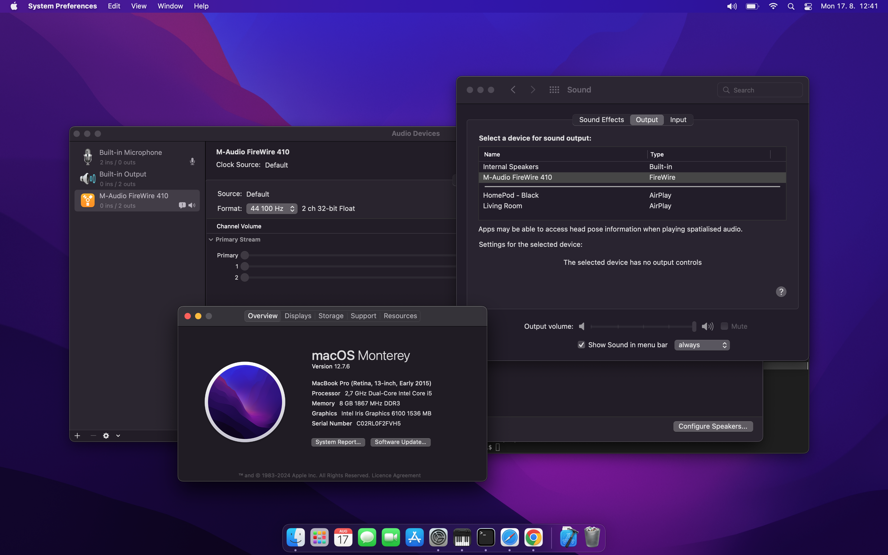

# FW410 project history

This file records visible project milestones rather than every diagnostic experiment. Detailed protocol and transport findings remain under `fw410/analysis/`.

## 2026-08-17 — First native macOS audio device

The macfw HAL AudioServerPlugIn was accepted by CoreAudio and appeared as **M-Audio FireWire 410** in both Audio MIDI Setup and the normal macOS audio output-device selector.

At this milestone:

- the device can be selected as the default and system output;
- CoreAudio starts and stops the device I/O thread successfully;
- stereo output is published;
- 44.1 kHz and 48 kHz are selectable;
- the HAL device is still synthetic at this exact checkpoint, so `WriteMix` accepts but discards PCM and no physical FW410 audio is produced yet.

Screenshot: [`pictures/screenshot1.png`](pictures/screenshot1.png)

This milestone proves the user-space HAL approach can expose the legacy FireWire 410 as a normal selectable macOS audio interface without requiring DriverKit provisioning. The next milestone is routing the HAL `WriteMix` PCM stream through shared memory into the already-proven native 44.1 kHz FireWire/AMDTP transport.

## 2026-08-17 — First clean hardware-backed CoreAudio playback

The complete 44.1 kHz playback path worked end to end with normal macOS audio applications and produced clear audio on physical FW410 Analog Outputs 1 and 2.

The proven path at this checkpoint is:

`macOS application -> CoreAudio HAL -> WriteMix -> shared-memory stereo Float32 ring -> halbridge44100 -> 10-channel FW410 PCM mapping -> PcmRingBuffer -> AmdtpPcmStream44100 -> FireWire ISO -> M-Audio FireWire 410`

Observed results:

- CoreAudio continuously supplied 192-frame `WriteMix` buffers;
- the HAL shared ring was consumed continuously by `halbridge44100`;
- live frame deltas were approximately 88,128-88,896 frames per two-second reporting interval, consistent with the 44.1 kHz stream;
- the FW410-specific post-start AV/C 44.1 kHz reassertion succeeded on both OUTPUT and INPUT plug 0;
- audio on Analog Outputs 1 and 2 was reported clear;
- Ctrl-C followed the guarded ISO/CMP cleanup path and the device read back successfully at 48 kHz after restoration.

This is the first milestone where the macfw CoreAudio device is not merely visible to macOS: ordinary application audio reaches the real FireWire hardware cleanly.

## 2026-08-18 — Native 48 kHz HAL playback validated

The HAL/shared-memory path was tested with CoreAudio and the FW410 both operating natively at 48 kHz, with no sample-rate conversion. The earlier audible degradation was isolated to transport scheduling margin rather than CoreAudio or SRC.

The first 48 kHz HAL transport inherited the older 128-cycle TX ring with 64-cycle refill halves. This provided only about 16 ms of total TX program and 8 ms per refill half, and playback sounded broken even though the HAL producer cadence was correct at approximately 48,000 frames/s.

An A/B test changed only the transmit geometry to the same larger scheduling margin used by the successful native 44.1 path:

- TX ring: 640 cycles;
- refill halves: 320 cycles;
- total programmed interval: about 80 ms;
- refill-half interval: about 40 ms.

With that change, native 48 kHz audio became clear. Increasing the internal PCM FIFO to 16,384 frames and draining all queued HAL frames each transport-loop iteration improved the remaining intermittent dropouts further.

The remaining small glitches correlate with desktop activity and brief shared-ring backlog rather than steady-state audio-format errors. This points to user-space scheduling jitter. The next controlled experiment therefore raises the transport loop to `QOS_CLASS_USER_INTERACTIVE`, keeps the proven 640/320 geometry, and reduces the fixed CoreFoundation run-loop wait while retaining callback servicing.

This milestone confirms that both native 44.1 kHz and native 48 kHz application playback can reach the real FW410 cleanly. The next architectural step is a single rate-aware companion transport rather than separate `halbridge44100` and `halbridge48000` executables.
